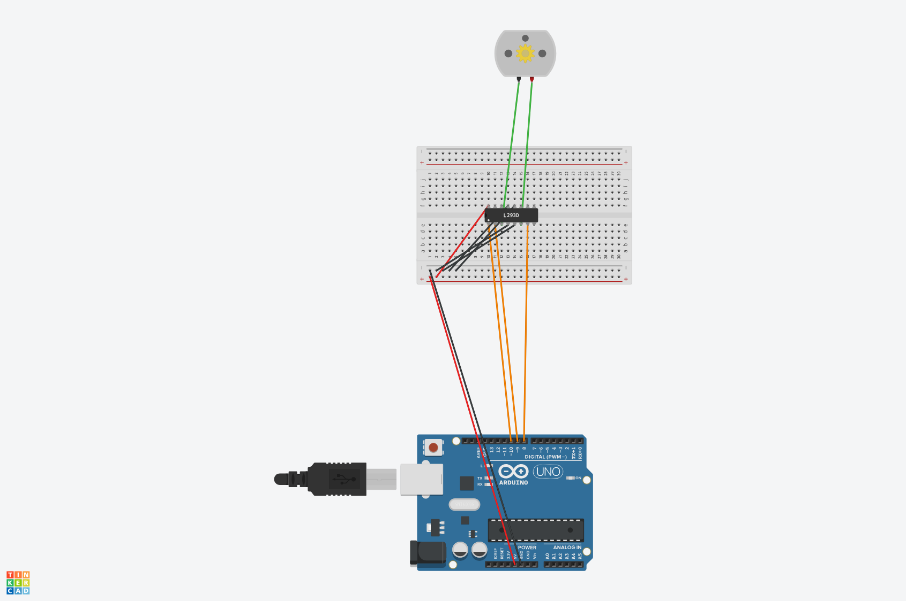

# 🛞 Enacar — The First Movement (a.k.a. I Just Wanted This Thing to Move)

## 📘 Overview

Alright listen up. This isn’t some NASA-grade AI rover (yet) — it’s **Enacar**, and this is version 0.0000001a.  
The goal? Make Motor A spin. That’s it. That’s the tweet.

This whole thing is less “professional engineering” and more “I’m fighting copper wires and battery packs with the rage of Zeus.”  
If you're reading this for inspiration — buckle up, 'cause this ride is sponsored by procrastination, taped wires, and raw willpower.

## 🧰 Hardware Requirements (a.k.a. What's in the Bag?)

- Arduino Uno (my baby)  
- L293D Motor Driver IC (the actual hero here)  
- 1 DC Motor (Motor A, the chosen one)  
- Breadboard (a.k.a. the plastic jungle)  
- Jumper wires (which may or may not work depending on their mood)  
- 6 AA batteries + holder (Duracell or riot)  
- Electrical tape (used more than it should be)  
- USB cable (power from the gods)  
- That one cousin you call when it doesn’t upload

## ⚙️ Circuit Description (aka “what the hell is going on?”)

So, Arduino is the brain. L293D is the muscles. Batteries are the protein shake.  
The brain says “move,” the muscles do it, and the protein keeps it alive.

We only wired **Motor A** — baby steps, alright?

### Wiring Table

| Arduino Pin | L293D Pin | What It Does                          |
|-------------|-----------|----------------------------------------|
| D10         | 1 (ENA)   | Gives motor permission to vibe ✅  
| D9          | 2 (IN1)   | Tells it where to spin ✅  
| D8          | 7 (IN2)   | Confuses the motor the other way ✅  
| 5V          | 16        | Brains need juice ✅  
| GND         | GND       | So everything shares trauma ✅  
| Motor A     | 3 & 6     | Motor output channels ✅  
| Battery (+) | 8         | Where the power party starts ✅  
| Battery (–) | GND       | Don’t forget this or NOTHING works ✅  

## 🔌 Circuit Diagram

  
🧠 Legend:  
- Green: Motor (obviously)  
- Orange: Direction & enable sauce  
- Red: Life juice ⚡  
- Black: Emotional grounding 🌑  

## 🧪 The Code (the magic spell)

```cpp
int enA = 10;
int in1 = 9;
int in2 = 8;

void setup() {
  pinMode(enA, OUTPUT);
  pinMode(in1, OUTPUT);
  pinMode(in2, OUTPUT);
  Serial.begin(9600);
  Serial.println("Enacar booting... 🧠⚙️");
}

void loop() {
  Serial.println("Motor A: FORWARD");
  digitalWrite(in1, HIGH);
  digitalWrite(in2, LOW);
  analogWrite(enA, 200);
  delay(2000);

  Serial.println("Motor A: STOP");
  analogWrite(enA, 0);
  delay(1000);

  Serial.println("Motor A: REVERSE");
  digitalWrite(in1, LOW);
  digitalWrite(in2, HIGH);
  analogWrite(enA, 200);
  delay(2000);

  Serial.println("Motor A: STOP");
  analogWrite(enA, 0);
  delay(1000);
}
```

## 💡 Learn From My Pain

- Don’t power motors from Arduino’s 5V pin unless you wanna see it faint.  
- Always **share ground** or the circuit gets ✨emotional✨.  
- Wires won’t strip themselves — you *will* become a caveman eventually.  
- The barrel jack? Lies. Cut it. Yeet it. Never trust it.  
- Electrical tape is now your soulmate. Stick to it. Literally.

## 😤 Lore Dump (Because Yes)

It all started with a wooden board, some motors, and existential dread. I stared into the void. It stared back.  
Then I saw the wires. The cursed, stiff, glued-worse-than-your-ex wires.

Copper? **Nonexistent.** I had to perform a full-scale **surgical extraction** with scissors, hope, and 0.3% knowledge of physics.  
But I struck it. I found copper. And in that moment — I became GOD.

Batteries were acquired. Connections made. USB plugged. Sketch uploaded.  
**AND IT MOVED.**  
One wheel. One motor. One glorious rotation.

And that's where the Enacar began. 😤🛞

---

📁 This is Enacar: Day 1. The revolution will not be stable. But it'll be cool as hell.
